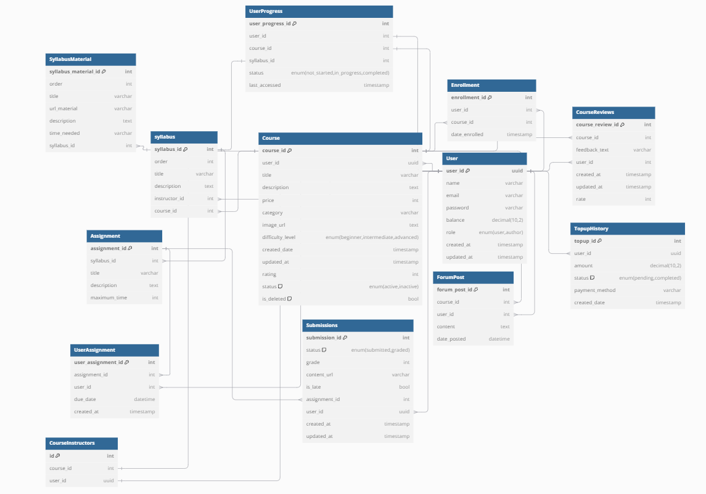
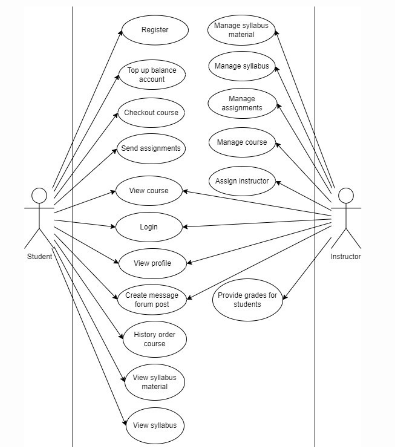
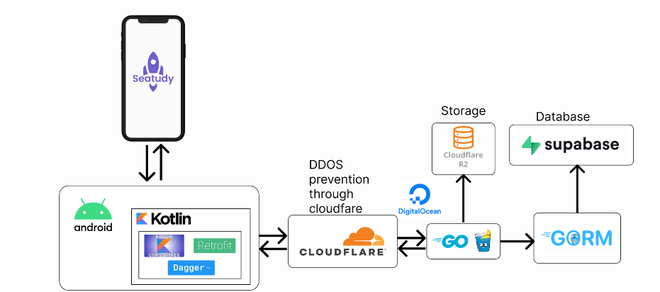

# SEATUDY

Welcome to the Seatudy Backend repository! This repository powers the backend functionality of the Seatudy platform, handling all core business logic, data operations, and providing API services for the application.

## Table of Contents

- [About](#about)
- [Documentation](#documentation)
- [Tech Stack](#tech-stack)
- [Features](#features)
- [Installation](#installation)
- [Developers](#developers)

## About

Seatudy is a comprehensive educational platform designed for users to efficiently manage their courses, monitor their learning progress, and share feedback through course reviews. It enables both students and instructors to interact, track milestones, and enhance the learning experience with robust tools for progress tracking and course management.

## Documentation

### Database Diagram



### Use Case Diagram



### System Design Diagram



## Tech Stack

- **Golang**: A fast, concurrent language designed for scalable server-side applications.
- **Gin**: A lightweight web framework in Go for building high-performance RESTful APIs.
- **GORM**: An ORM library for Go, simplifying database operations with PostgreSQL.
- **Supabase PostgreSQL**: A hosted PostgreSQL service offering robust data management and real-time capabilities.
- **Cloudflare R2**: A reliable, cost-effective object storage solution for files like images and media.
- **Cloudflare**: Provides enhanced security, including DDoS protection, ensuring stability during high traffic.
- **JWT (JSON Web Token)**: Securely handles user authentication and session management across APIs.
- **Github Actions**: Automates the CI/CD pipeline for building, testing, and deploying code.
- **Digital Ocean**: Hosts the backend infrastructure with scalability and reliable cloud services.

## Features

- **User Authentication**: Secure user registration, login, and session management.
- **Course Management**: Instructors can create, update, and manage their courses easily.
- **Progress Tracking**: Tracks student progress throughout their learning journey.
- **Review System**: Allows users to provide ratings and feedback on courses.
- **Community Forum**: A space for users to discuss, ask questions, and share insights.
- **Role-Based Access Control**: Manages user permissions based on roles (e.g., student, instructor).
- **File Uploads**: Supports uploading course materials, images, and assignments.

## Installation

### Steps

1. **Clone the Repository:**
   ```bash
   git clone https://github.com/AlbertChoe/Seastudy-Backend.git
   ```
2. **Navigate to the Project Directory:**
   ```bash
   cd Seastudy-Backend
   ```
3. **Set Up Environment Variables:**  
   Create a `.env` file in the root directory and provide the necessary environment variables. See `.env.example` file for reference.

4. **Run the server:**
   ```bash
   go run main.go
   ```
   This will start the backend server for the Seatudy project.

## Developers

### Back-end

- **Albert**
- **Dimas Akmal Andrian**

### Front-end

- **Dewa Tri Wijaya**
- **Muhammad Ibra Alfathar**

## Development

To enable hot reloading for development using Air, run the following:

```bash
air
```
